# 单/双/四基站&信标/手环规格书 V2.1

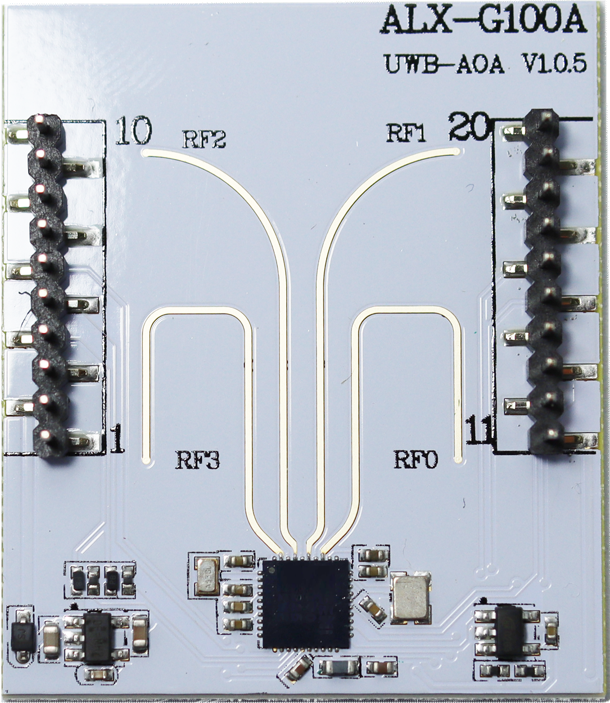
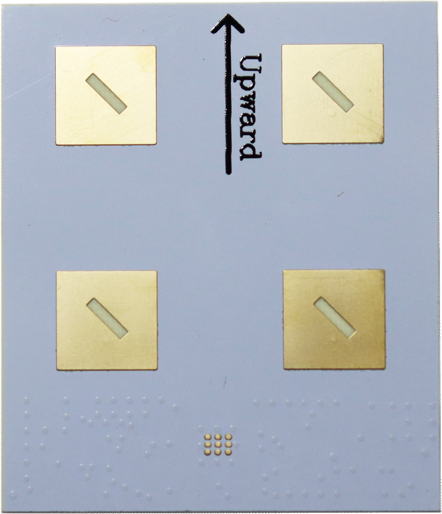

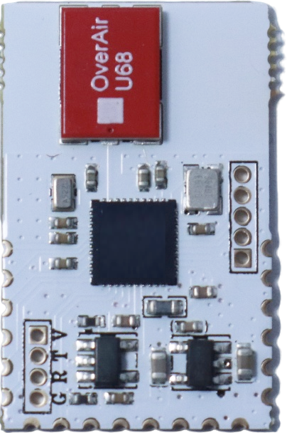
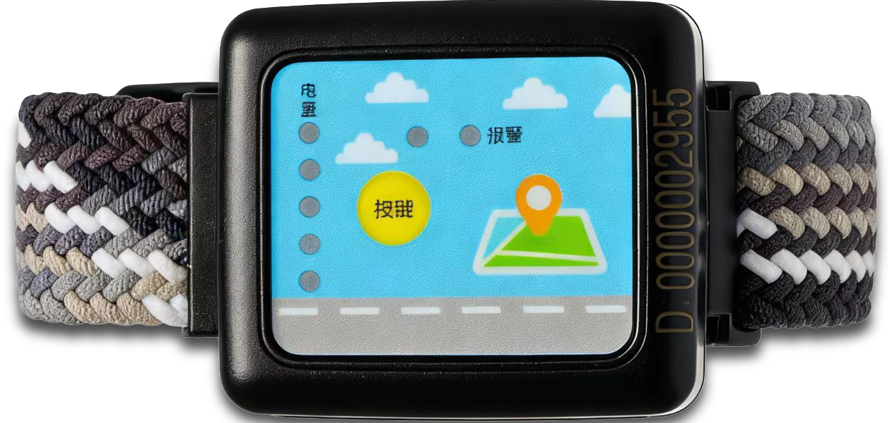

# 苏州爱蓝信电子科技有限公司

2026 年 3 月

## 目录
- **产品介绍** 3
- **产品特点** 3
- **应用方案** 4
- **产品参数** 5
- **硬件接口** 6
- 基站接口定义 6
- 基站转接板接口定义 7
- 信标接口定义 8
- 信标转接板接口定义 8
- 手环使用说明 9
- **通信协议** 10
- 基础格式与数据类型 10
- 主动协议介绍 10
- **上位机展示** 11

- **产品介绍**
ALX-AOA-FIT 是苏州爱蓝信科技基于最新单芯片 UWB 芯片开发的自动跟随套件。ALX-AOA-FIT 基站全新全研发设计采用单芯片 4 天线 AOA 方 案，芯片内置 32 位 MCU,性能相比市场上同类产品遥遥领先。系统具有简单易用、超高精度、体积小等优点，完全胜任车辆跟随、机器人跟随、舞台追光灯跟随等场景。
- **产品特点**
高精度定位：UWB 能够提供厘米级的定位精度。通过测量信号到达角度可以非常精确地确定目标的位置。
抗干扰能力强：UWB 采用非常宽的频谱（3.1 GHz 至 10.6 GHz），能够有效 避开其他无线信号的干扰，因此在复杂环境下的定位精度仍然较高。
低功耗：UWB 技术在低功耗的情况下能够进行高精度的数据传输，因此适合长时间运行的自动跟随应用。
实时性：UWB 定位系统能够实时跟踪目标的位置，确保系统能够实时响应，适合需要高速反馈的场景，如无人驾驶、物流跟踪等。
穿透能力强：UWB 信号具有一定的穿透能力，能够在墙壁等障碍物间传播，因此在复杂的室内环境中也能保持较好的定位效果。
低延迟：UWB 的低延迟特性使其在需要快速响应的自动跟随应用中表现出色，适合实时控制。
精准的距离角度测量：采用全新的单芯片 4 天线 AOA 设计可以非常准确地测量信标与基站之间的距离，这对于自动跟随系统的距离保持、避障等操作至关重要。

- **应用方案**
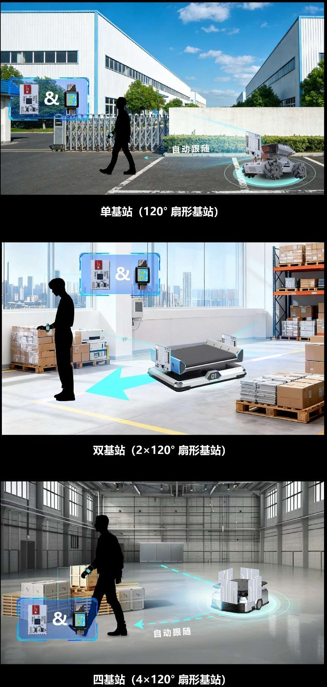
注意：可以测量 180 度范围，但受到天线的局限性 120 度范围内数据准确性更好。

- **产品参数**
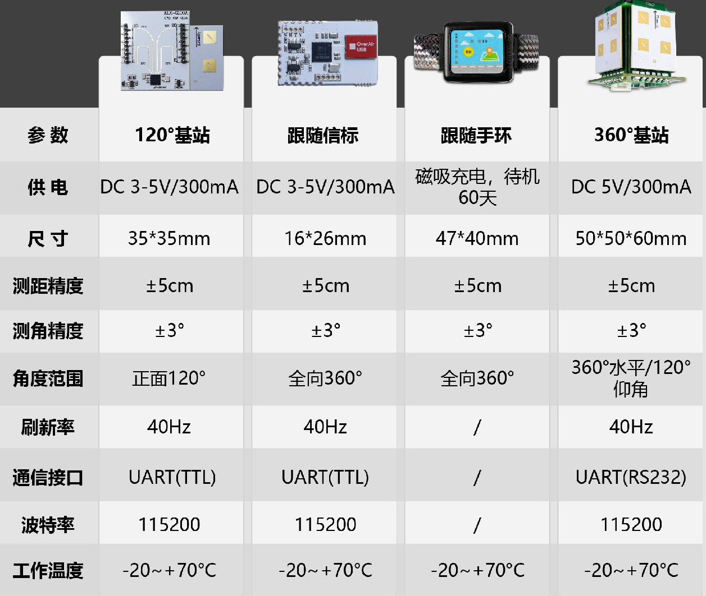

- **硬件接口**
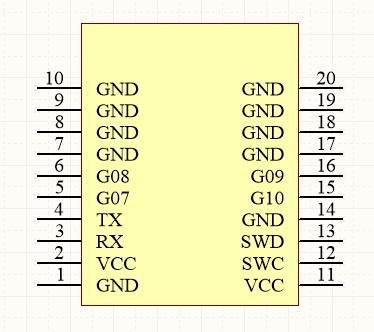
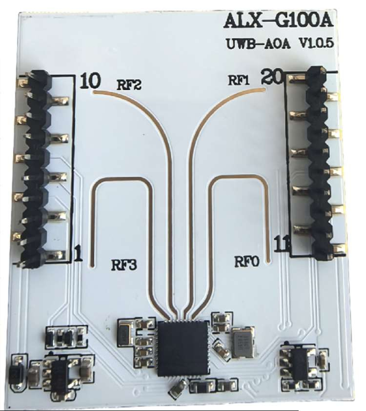
- **基站接口定义**

| 管脚 | 说明 |
| --- | --- |
| 1、7、8、9、10、 14、17、18、19、20 | GND 多个管脚选一处接地即可 |
| 2、11 | VCC 供电电源 3-5V 推荐 3.3V， 两个管脚选一处接 VCC 即可。 |
| 3 | RX@3.3V |
| 4 | TX@3.3V |
| 5 | GPIO7 信标在线时，电平 500ms 翻转一次，推荐外围电路增加 LED。 |
| 6、12、13、15、16 | 悬空 |

- **基站转接板接口定义**
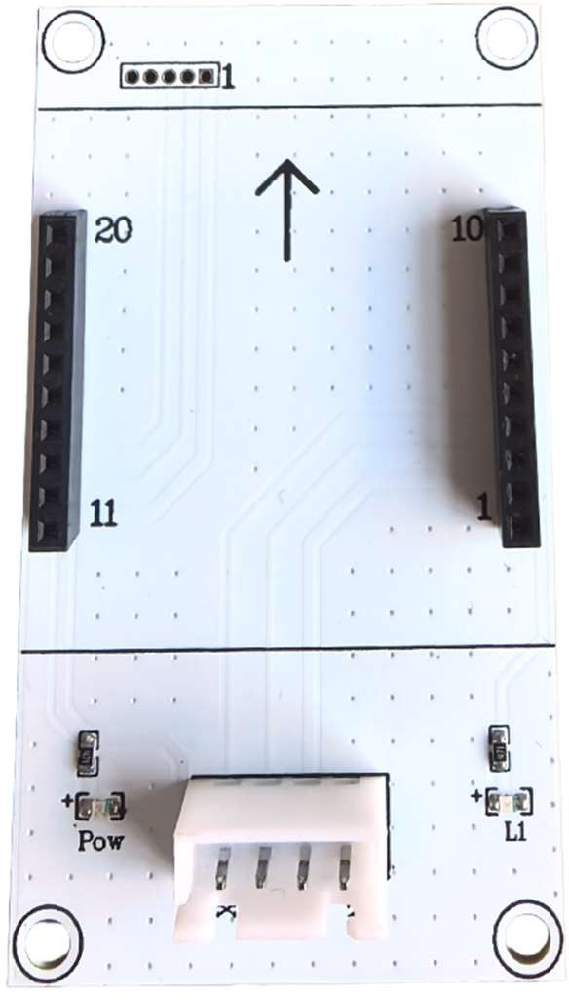

Pin1	Pin4

| Pin1 | Pin2 | Pin3 | Pin4 |
| --- | --- | --- | --- |
| TX | RX | 5V | GND |

UART（TTL@115200bps）
AOA-FIT 基站和信标除可通过 USB 接❑连接 PC 进行数据传输外，也板载了 UART(TTL)串行通信接❑，可接入其他单片机、Arduino 等设备进行数据发送和二次开发接入时请对应好模块的 TX 管脚连接目标模块的 RX 管脚，两模块的 GND 直连。
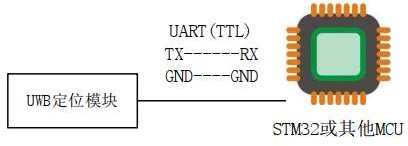

- **信标接口定义**
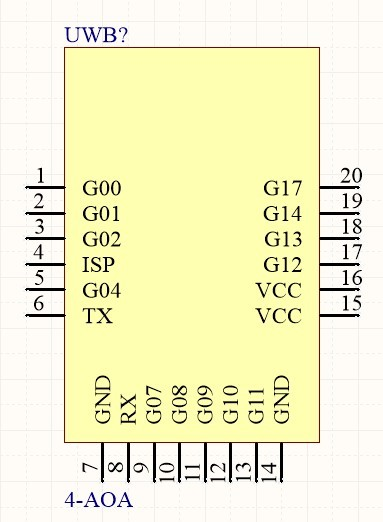
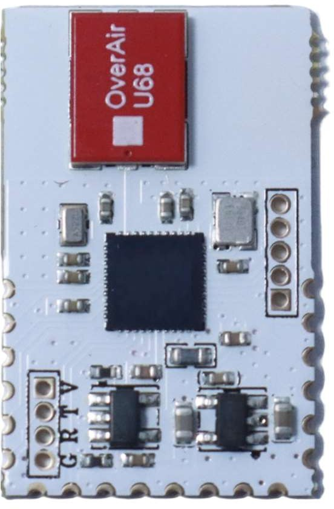

| 管脚 | 说明 |
| --- | --- |
| 6 脚 | TX@3.3V |
| 7 脚、14 脚 | GND |
| 8 脚 | RX@3.3V |
| 15 脚、16 脚 | VCC 供电电源 3-5V 推荐 3.3V |

- **信标转接板接口定义**
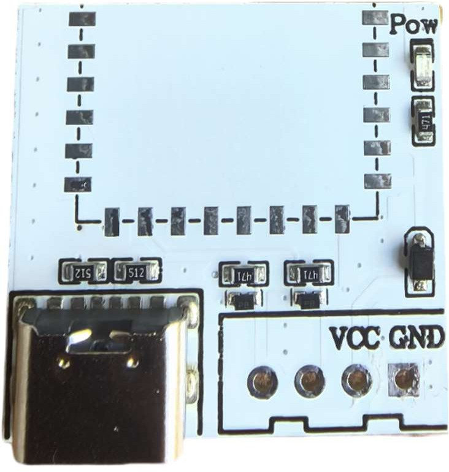
Pin1	Pin4

| Pin1 | Pin2 | Pin3 | Pin4 |
| --- | --- | --- | --- |
| TX | RX | 3V-5V | GND |

UART（TTL@115200bps）
注意：信标与转接板出货默认不焊接，有焊接需求请联系备注。

- **手环使用说明**
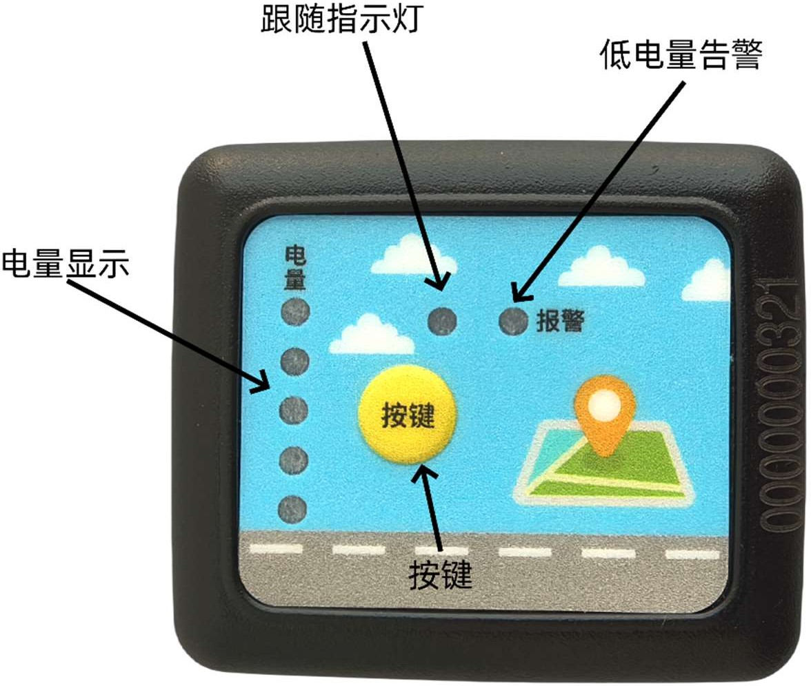

- 双击按键，进入跟随模式或退出跟随模式，绿灯亮起处于跟随模式，绿灯灭退出跟随模式
- 按键按 1 次显示电量，有低电量红灯告警。
- 背面磁吸充电

注意：处于跟随模式较为耗电，不使用时请退出跟随模式

- 通信协议
- 基础格式与数据类型

采用串❑通讯方式，通信波特率为 115200、数位 8、停止位 1、无校验、无流程控制，16进制发送，16 进制接收；
- 主动协议介绍

标签与基站之间有通信情况下，基站主动向 PC 发送定位信息命令。命令码：0x2001
消息结构：

| 字段 | 长度 /byte | 数据类型 | 说明 |
| --- | --- | --- | --- |
| MessageHeader | 4 | unsigned Integer | 4 个连续的 0xFF 表示消息开始 |
| PacketLength | 2 | unsigned Integer | 消息体长度 |
| SequenceID | 2 | unsigned Integer | 消息流水号 |
| RequestCommand | 2 | unsigned Integer | 命令码 |
| VersionID | 2 | unsigned Integer | 协议版本，此版本固定 0x0100 |
| AnchorID | 4 | unsigned Integer | 基站 ID |
| TagID | 4 | unsigned Integer | 标签 ID |
| Distance | 4 | unsigned Integer | 标签与基站间的距离，单位 cm |
| Azimuth | 2 | signed Integer | 标签与基站间的方位角，单位度 |
| Elevation | 2 | signed Integer | 标签与基站间的仰角，单位度 |
| TagStatus | 2 | Byte | 标签的状态 |
| BatchSn | 2 | Byte | 测距序号 |
| Reserve | 4 | Byte | 预留 |
| XorByte | 1 | Byte | 该字节前所有字节的异或校验 |

举例 1：距离：25cm 角度：18 度
FF FF FF FF 00 25 00 0B 20 01 01 00 00 00 AA A2 00 00 AA A1 00 00 00 19 00 12 FF CA 12 34 00 0B 00 00 00 00 1E
开始	长度 流号 命令 版本 基站 ID	信标 ID	距离	角度 仰角 状态 序号	预留 校验
举例 2：距离：98cm 角度：-39 度
FF FF FF FF 00 25 00 27 20 01 01 00 00 00 AA A2 00 00 AA A1 00 00 00 62 FF D9 00 0D 12 34 00 27 00 00 00 00 69

注意：上传数据均自带卡尔曼滤波。

基站一方不在线时，基站主动向 PC 2 s 发送 1 次心跳包信息命令。命令码：0x2002
消息结构：

| 字段 | 长度 /byte | 数据类型 | 说明 |
| --- | --- | --- | --- |
| MessageHeader | 4 | unsigned Integer | 4 个连续的 0xFF 表示消息开始 |
| PacketLength | 2 | unsigned Integer | 消息体长度 |
| SequenceID | 2 | unsigned Integer | 消息流水号 |
| RequestCommand | 2 | unsigned Integer | 命令码 |
| VersionID | 2 | unsigned Integer | 协议版本，此版本固定 0x0101 |
| AnchorID | 4 | unsigned Integer | ID |

- **上位机展示**
举例 1：

FF FF FF FF 00 10 00 0B 20 02 01 01 00 00 AA A1

开始	长度 流号 命令 版本	ID

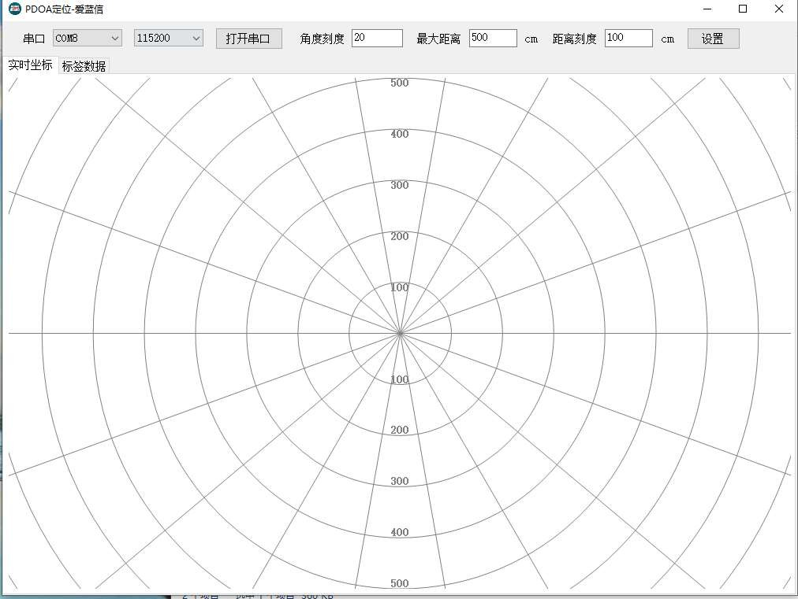